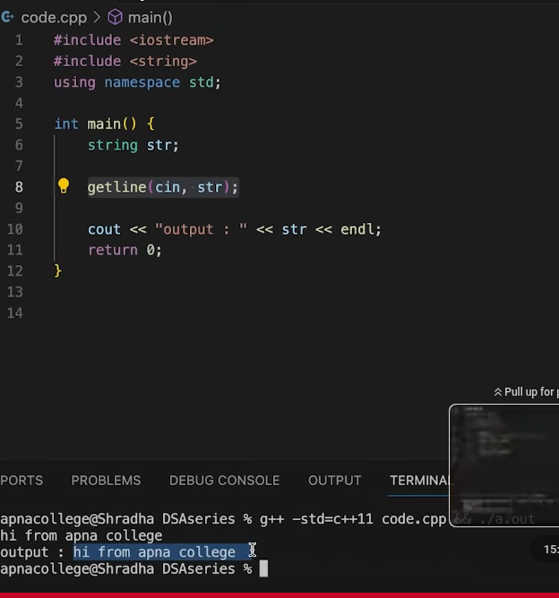
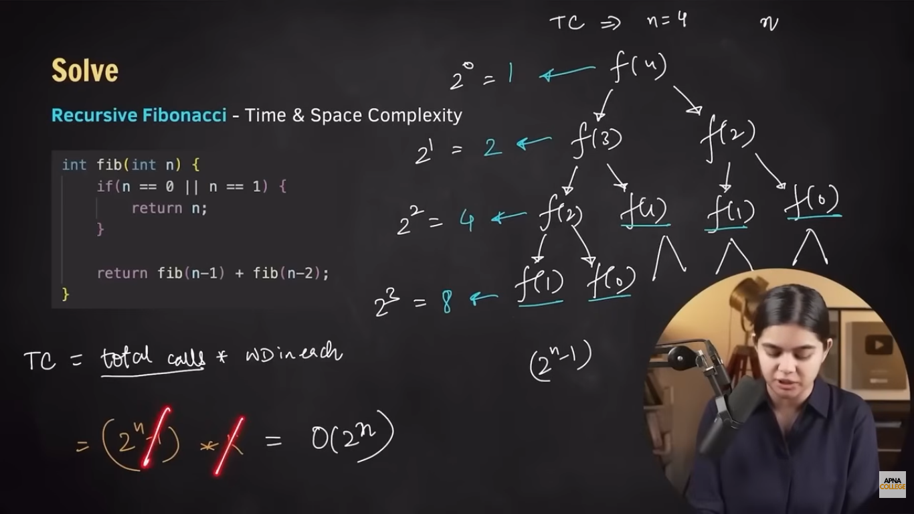
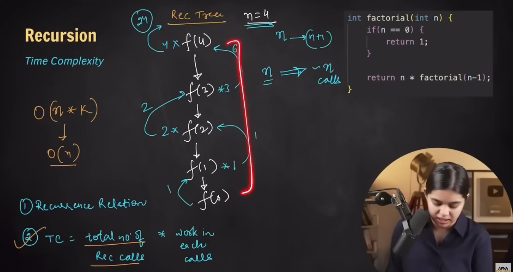
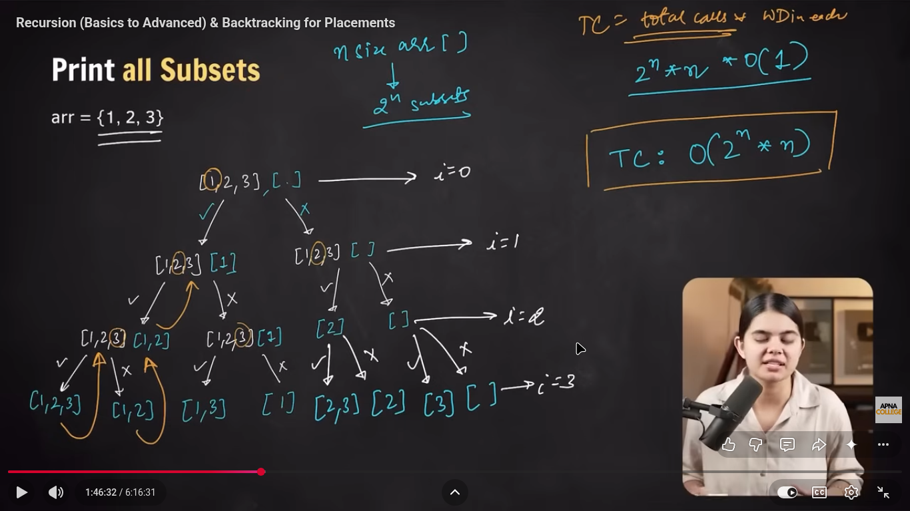
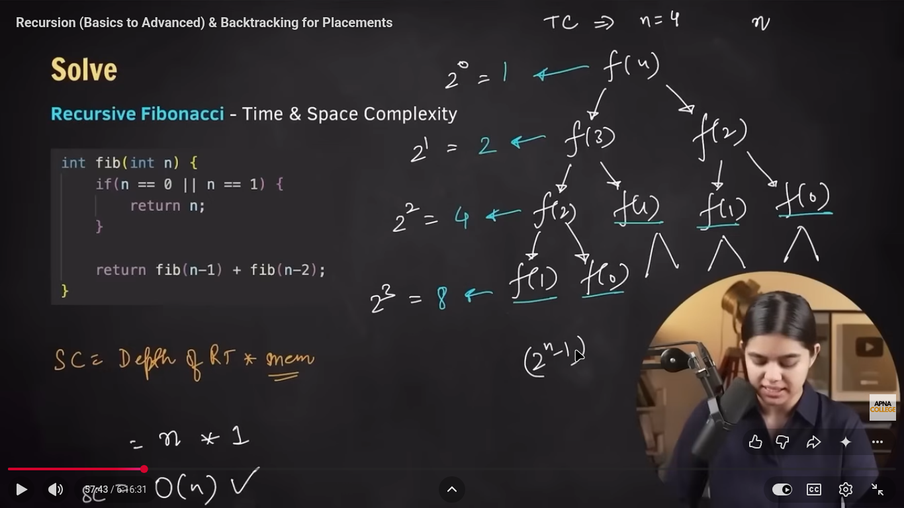
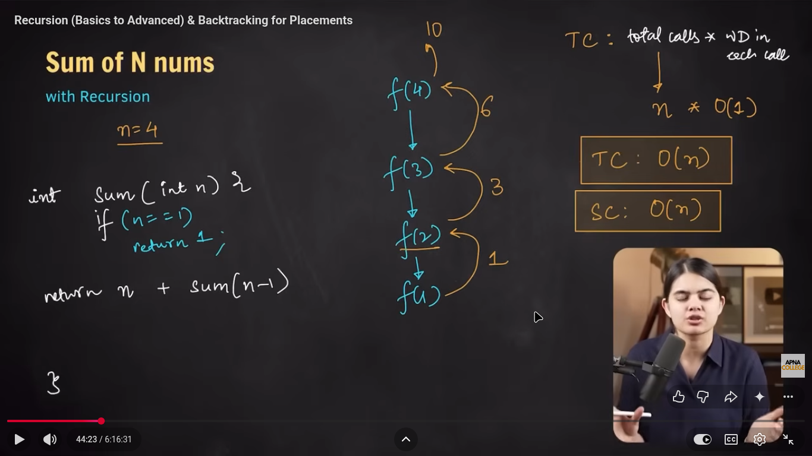

# my Notes 
## Binary system 
   
        
   

 ## max / min concept 
 *use lib  include < climits >*
->->-> for min value find =>   n > INT_MIN ;

->->-> for max value find =>   n > INT_MAX ;

# 1 VECTOR
Definition:
Dynamic array (size change ho sakta hai)

Header:
#include <vector>

When to use:
- Default container
- Random access chahiye (arr[i])
- End me insert/delete

Syntax:
vector<int> v;

Important Functions:
v.push_back(x);
v.pop_back();
v.size();
v.empty();
v.clear();

Access:
v[i]
v.at(i)


# DEQUE
Definition:
Double ended queue (front + back dono side se insert/remove)

Header:
#include <deque>

When to use:
- Front aur back dono jagah operations chahiye

Syntax:
deque<int> dq;

Important Functions:
dq.push_back(x);
dq.push_front(x);
dq.pop_back();
dq.pop_front();


# LIST
Definition:
Doubly linked list

Header:
#include <list>

When to use:
- Beech me insert/delete zyada ho
- Random access ki zarurat nahi

Syntax:
list<int> l;

Important:
l.push_back(x);
l.push_front(x);
l.pop_back();
l.pop_front();
l.insert(iterator, value);

Note:
l[i] allowed nahi


# STACK
Definition:
LIFO (Last In First Out)

Header:
#include <stack>

When to use:
- Bracket checking
- Undo system

Syntax:
stack<int> st;

Functions:
st.push(x);
st.pop();
st.top();
st.empty();


# QUEUE
Definition:
FIFO (First In First Out)

Header:
#include <queue>

When to use:
- BFS
- Line system

Syntax:
queue<int> q;

Functions:
q.push(x);
q.pop();
q.front();
q.empty();


# PRIORITY_QUEUE
Definition:
Heap based container (largest element top pe)

Header:
#include <queue>

When to use:
- Highest/Lowest element always top pe chahiye
- Dijkstra

Syntax:
priority_queue<int> pq;

Min Heap:
priority_queue<int, vector<int>, greater<int>> pq;

Functions:
pq.push(x);
pq.pop();
pq.top();


# SET
Definition:
Unique + Sorted values

Header:
#include <set>

When to use:
- Duplicate remove karna ho
- Sorted order chahiye

Syntax:
set<int> s;

Functions:
s.insert(x);
s.erase(x);
s.find(x);
s.count(x);


# UNORDERED_SET
Definition:
Unique values (No sorting)

Header:
#include <unordered_set>

When to use:
- Fast lookup chahiye
- Sorting important nahi

Syntax:
unordered_set<int> s;


# MAP
Definition:
Key → Value pair (Sorted by key)

Header:
#include <map>

When to use:
- Frequency count
- Key-value storage

Syntax:
map<string, int> mp;

Functions:
mp[key] = value;
mp[key]++;
mp.erase(key);
mp.find(key);


# UNORDERED_MAP
Definition:
Key → Value (Fast, no sorting)

Header:
#include <unordered_map>

When to use:
- Fast frequency count

Syntax:
unordered_map<string, int> mp;


# ALGORITHM
Definition:
Ready-made functions for searching/sorting

Header:
#include <algorithm>

Important Functions:
sort(v.begin(), v.end());
reverse(v.begin(), v.end());
find(v.begin(), v.end(), x);
count(v.begin(), v.end(), x);
binary_search(v.begin(), v.end(), x);
max_element(v.begin(), v.end());
min_element(v.begin(), v.end());


# STL_MASTER_CHEAT_SHEET_WITH_MEANING

========================================
#VECTOR
========================================

vector<int> v; 
// int type ka dynamic array bana

v.push_back(x); 
// element x ko end me add kare

v.pop_back(); 
// last element remove kare

v.size(); 
// current elements ki count return kare

v.empty(); 
// check kare vector empty hai ya nahi (true/false)

v.clear(); 
// saare elements delete kare

v[i]; 
// index i ka element access kare (O(1))

v.at(i); 
// safe access (is used to direct access the element at index i in a vector.)

----------------------------------------

========================================
#DEQUE
========================================

deque<int> dq; 
// double ended dynamic container

dq.push_back(x); 
// end me add kare

dq.push_front(x); 
// front me add kare

dq.pop_back(); 
// end se remove kare

dq.pop_front(); 
// front se remove kare

----------------------------------------

========================================
#LIST
========================================

list<int> l; 
// doubly linked list container

l.push_back(x); 
// end me add

l.push_front(x); 
// front me add

l.insert(it, x); 
// iterator position pe x insert kare

l.erase(it); 
// iterator position ka element delete kare

Note:
// random access allowed nahi (l[i] nahi chalega)

----------------------------------------

========================================
#STACK
========================================

stack<int> st; 
// LIFO structure

st.push(x); 
// element add kare (top pe)

st.pop(); 
// top element remove kare

st.top(); 
// current top element return kare

st.empty(); 
// check kare empty hai ya nahi

----------------------------------------
15
========================================
#QUEUE
========================================

queue<int> q; 
// FIFO structure

q.push(x); 
// element end me add kare

q.pop(); 
// front element remove kare

q.front(); 
// front element return kare

q.empty(); 
// empty check kare

----------------------------------------

========================================
#PRIORITY_QUEUE
========================================

priority_queue<int> pq; 
// default max heap (largest element top pe)

pq.push(x); 
// element insert kare

pq.pop(); 
// top element remove kare

pq.top(); 
// highest priority element return kare

priority_queue<int, vector<int>, greater<int>> pq; 
// min heap banaye (smallest element top pe)

--------------------------------------

# string
1-> use lib => #include <string>
2 -> for use this if i write a statment with (" ", "\t","/n", etc) 
   


# capital char into small char logic 
   
 char (ch) {
   if(ch>='a' && ch <= 'z') {
    return ch;
   }
   else {
    ========>>>>>>>>>>>>>>>>>>>>>  *char result = ch - 'A' + 'a'*;
    return /* -> */ result;
   }
}

# cat decigion 
```mermaid
flowchart LR
  Sleep[Sleep] --> Wake{Awake?}
  Wake -->|No| Sleep
  Wake -->|Hungry| Snack[Get treat]
  Wake -->|Not in in Sun?| Move[Move to sun]
  Wake -->|Human is typing| Keyboard[Sleep on keyboard]
  Snack --> Sleep#include #include #include using namespace std;void subset(vector &arr, vector &ans, vector<vector> &allsubset, int i){

if (i == arr.size()) {     allsubset.push_back(ans);     return; } // include are element ans.push_back(arr[i]); subset(arr, ans, allsubset, i + 1); ans.pop_back(); int index = i + 1; while (index < arr.size() && arr[index] == arr[index - 1])     index++; // excludeing subset(arr, ans, allsubset, index);

}

int main(){int i;int n;cout << "value of n: ";cin >> n;vector arr(n);// input arr valuefor (int i = 0; i < n; i++){cout << "enter numbers :";cin >> arr[i];}sort(arr.begin(), arr.end());vector ans;vector<vector> allsubset;subset(arr, ans, allsubset, 0);for (auto result : allsubset) //  => for (int i = 0; i < allsubset.size(); i++){                             // => auto use for automatic update correct databasecout << "{ ";

    for (auto x : result) // ==>> for (int i = 0; i < subset.size(); i++)         cout << x << " ";      cout << "}\n"; } return 0;

}

or han wo auto ka mean mujhe pata han wo toh bas mane self understanding k liye type kiya tha bas
  Move --> Sleep
  Keyboard --> Sleep
```
# time complexity (TC) of recursion codes 

1. TC of Fiboncci series -->> 


2. TC of Sum of Number ->>  

3. TC of binarysearch -->> 

4. Subset T.C and S.C -->> 

# space complexity (SC) of recursion codes 
1. SC of Fibonnci series -->> 

2. SC of sum of no. -->> 

3. SC of Binnary search also equal to TC of binarysearch.
